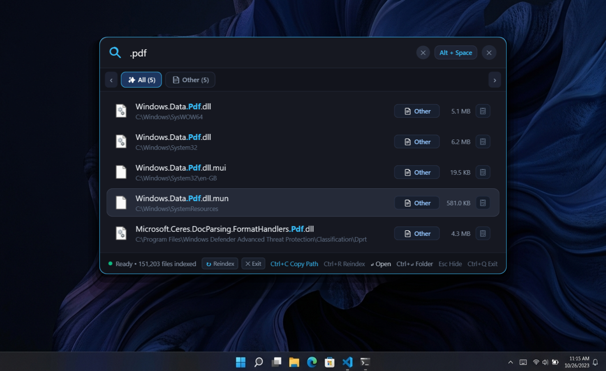

<p align="center">
  
</p>

<h1 align="center">Finder</h1>

<p align="center">
  <b>⚡ Ultra-Fast, Intelligent System-Wide File & Application Search for Windows</b><br/>
  <i>Spotlight / Raycast-style instant search with a sleek dark UI, real-time filesystem sync, and < 50 MB RAM footprint.</i>
</p>

<p align="center">
  <a href="https://github.com/rjppppppp/Finder/releases/latest">
    
  </a>
  <a href="https://github.com/rjppppppp/Finder/releases">
    
  </a>
  
  
  
  
  
</p>

<p align="center">
  <a href="#-quick-download">Download</a> •
  <a href="#-why-finder--benchmarks">Why Finder?</a> •
  <a href="#-key-features">Features</a> •
  <a href="#-keyboard-shortcuts">Shortcuts</a> •
  <a href="#-architecture--performance">Architecture</a> •
  <a href="#-building-from-source">Build</a> •
  <a href="#-license">License</a>
</p>

---

<p align="center">
  
</p>

---

## ⚡ What is Finder?

Windows Search is notorious for being sluggish, resource-heavy, and cluttered with unwanted web search results and telemetry. 

**Finder** is an ultra-lightweight, blazing-fast desktop utility built from scratch in C# and .NET 8 (WPF) by **TN Dev Lab Studio**. Summoned instantly via a global hotkey (**`Alt + Space`**), it indexes hundreds of thousands of files across all your drives and returns search results in sub-milliseconds without hogging your CPU or memory.

Developed under a strict **< 50 MB RAM budget**, Finder stays quiet in your system tray, automatically captures file changes in real-time, and is **100% offline and free**.

---

## 📊 Why Finder? (Benchmark & Comparison)

| Feature | ⚡ **Finder** *(TN Dev Lab)* | Windows Search | PowerToys Run | Everything |
| :--- | :---: | :---: | :---: | :---: |
| **Idle Memory (RAM)** | **~35 – 45 MB** | 250 MB – 500 MB | 150 MB – 300 MB | 70 MB – 120 MB |
| **Search Response Time** | **Sub-millisecond (1–3 ms)** | 300 ms – 1500 ms (Laggy) | 50 ms – 150 ms | Sub-millisecond |
| **Global Hotkey** | **`Alt + Space`** | `Win + S` | `Alt + Space` | Custom |
| **User Interface** | **Sleek Floating Dark UI** | Heavy Windows Sidebar | Boxy Launcher | 1990s Table Grid |
| **Fuzzy Typo-Tolerance** | **Yes (Damerau-Levenshtein)** | ❌ No | ⚠️ Partial | ❌ Strict Regex Only |
| **Live Real-Time Sync** | **Yes (`FileSystemWatcher`)** | Indexing Delays | Periodic Updates | USN Journal Sync |
| **Web Ads & Telemetry** | **Zero (100% Offline)** | Bing Ads & Cloud Sync | None | None |
| **One-Click Path Copy** | **`Ctrl + C` / Dedicated Button** | 3-4 Clicks | Context Menu | Context Menu |
| **Open Source** | **MIT License** | Closed Source | MIT License | Freeware (Closed) |

---

## 📥 Quick Download

| Package | Type | Description | Link |
| :--- | :--- | :--- | :--- |
| **FinderSetup.exe** | **Installer (Recommended)** | Single-click native installer with automatic startup & desktop shortcut | [⬇️ Download Installer (v1.0.0)](https://github.com/rjppppppp/Finder/releases/download/v1.0.0/FinderSetup.exe) |
| **Finder-Portable-v1.0.0.zip** | **Portable Binary** | Standalone single-file executable, zero installation or admin rights required | [⬇️ Download Portable ZIP](https://github.com/rjppppppp/Finder/releases/download/v1.0.0/Finder-Portable-v1.0.0.zip) |

---

## ✨ Key Features

- **🚀 Instant Invocation (`Alt + Space`):**
  - Floats smoothly above any fullscreen application, IDE, or game.
  - Automatically hides when clicking anywhere outside (`OnDeactivated`) or pressing `Esc`.
  - Freely draggable anywhere across your monitors.

- **🔍 Sub-Millisecond Search Response:**
  - Parallel multi-core scanning matches against hundreds of thousands of files in 1–3 ms.
  - Zero-allocation string comparisons without generating garbage collection heap pressure.

- **🧠 Typo-Tolerance & Acronym Matching:**
  - **Fuzzy Damerau-Levenshtein Tolerance:** Typing `exel` finds `excel.exe`, `chorme` finds `chrome.exe`, and `pyhton` finds `python.exe`.
  - **Acronyms:** Typing `vsc` instantly matches `Visual Studio Code`.
  - **Multi-Word Search:** Queries like `invoice 2024` or `project plan` match file names across word boundaries.

- **📂 Slidable Category Filter Pills:**
  - Real-time category counters: `✨ All`, `📁 Folder`, `💻 Code`, `📄 Document`, `🖼️ Image`, `🎬 Video`, `🎵 Audio`, `📦 Archive`, `📄 Other`.
  - Slide horizontally via **mouse drag / swipe**, **mouse scroll wheel**, touchpad gestures, or navigation chevrons.
  - High-contrast crisp white category icons on dark backgrounds for optimal readability.

- **📋 One-Click Copy Path & Actions:**
  - Quick copy button (`📋`) in results list.
  - `Ctrl + C` shortcut to immediately copy the full path with animated toast notification.
  - Right-click context menu: `📋 Copy Full Path`, `📁 Open Containing Folder`, `🚀 Open / Launch`.

- **🔄 Real-Time Live File Sync (`FileSystemWatcher`):**
  - Watches all local and removable drives in real-time.
  - Automatically captures file creations, renames, and deletions in real time—**no manual re-indexing required**.

- **🛡️ Ultra-Low Memory Footprint (< 50 MB RAM):**
  - Non-LOH 64 KB chunked record allocation (`ChunkedRecordList`).
  - Zero-allocation string deduplication pool (`StringPool`).
  - Active working set trimming via native Win32 `psapi.dll`.

- **🧭 System Tray & Background Execution:**
  - Native Win32 notification area tray icon with context menu ("Open", "Reindex", "Exit").
  - Clean exit button in footer and `Ctrl + Q` / `Alt + F4` shortcut.

---

## ⌨️ Keyboard Shortcuts

| Shortcut | Action |
| :--- | :--- |
| **`Alt + Space`** *(or `Ctrl + Space`)* | Toggle Finder window (Show / Hide) |
| **`↵ Enter`** | Launch the selected file or application |
| **`Ctrl + ↵ Enter`** / **`Alt + ↵ Enter`** | Open containing folder in Windows Explorer with file selected |
| **`Ctrl + C`** | Copy full file path to clipboard (with toast feedback) |
| **`↑` / `↓`** | Navigate through search results list |
| **`Esc`** | Clear search input / Hide Finder |
| **`Ctrl + R`** / **`F5`** | Trigger manual full-system re-indexing |
| **`Ctrl + Q`** / **`Alt + F4`** | Exit Finder completely |

---

## 🏗️ Architecture & Performance

Finder is engineered from the ground up for raw speed and minimal resource usage:

```
Finder/
├── Controls/
│   └── HighlightedTextBlock.cs  # Zero-allocation two-pointer highlight renderer
├── Models/
│   ├── FileRecord.cs            # Compact 16-byte struct (DirIndex, Name, IsDirectory)
│   ├── SearchCandidate.cs       # Transient search match struct (avoids heap allocations)
│   ├── SearchResultItem.cs      # Bound search item with category badge & copy action
│   ├── CategoryCount.cs         # Category filter pill model with count & styling
│   └── SearchResponse.cs        # Payload containing items & category counts
├── Services/
│   ├── FastDirectoryScanner.cs  # Native Win32 FindFirstFileExW high-speed disk scanner
│   ├── FileIndexService.cs      # Background indexing, real-time watchers & search engine
│   ├── FuzzySearchEngine.cs     # Typo tolerance, strict extensions & acronym matching
│   ├── FileCategoryHelper.cs    # File extension to category classifier & icons
│   ├── ChunkedRecordList.cs     # 64 KB non-LOH contiguous chunked record store
│   ├── StringPool.cs            # Zero-allocation 128 KB direct-mapped string deduplicator
│   ├── HotKeyManager.cs         # Win32 RegisterHotKey with fallback support
│   ├── TrayIconManager.cs       # Native Win32 notification area tray manager
│   ├── StartupHelper.cs         # Windows Task Manager Startup registry manager
│   └── IconHelper.cs            # On-demand Win32 SHGetFileInfo with caching
└── Setup/
    ├── NativeInstaller.cs       # Ultra-lightweight .NET 4.8 native single-file installer UI
    ├── build_installer.ps1      # Compiles standalone installer executable
    └── Setup.ps1                # Scripted setup and registration runner
```

### Key Technical Innovations:
1. **Contiguous Chunked Storage:** Uses 64 KB non-LOH contiguous arrays (4,096 records per chunk), preventing Large Object Heap fragmentation.
2. **On-Demand Resolution:** Full paths, file sizes, and high-res shell icons are resolved strictly on-demand for visible items (50 items per page), keeping CPU overhead minimal.
3. **Smooth Virtualization:** List virtualizer maintains a 20-item off-screen GPU cache and a 350px proactive prefetch buffer for butter-smooth 60+ FPS scrolling.
4. **Direct-Mapped String Pool:** Filenames deduplicated across folders using a zero-allocation 128 KB direct-mapped pool.

---

## 🛠️ Building from Source

### Prerequisites
- Windows 10 (Build 19041+) or Windows 11
- [.NET 8.0 SDK](https://dotnet.microsoft.com/download/dotnet/8.0)

### 1. Clone the Repository
```powershell
git clone https://github.com/rjppppppp/Finder.git
cd Finder
```

### 2. Build & Run (Debug)
```powershell
dotnet build
dotnet run
```

### 3. Build Standalone Portable Executable
```powershell
powershell -Command "Stop-Process -Name FinderApp, Finder -Force -ErrorAction SilentlyContinue"
dotnet publish -c Release -r win-x64 --self-contained true -p:PublishSingleFile=true -p:IncludeNativeLibrariesForSelfExtract=true -p:EnableCompressionInSingleFile=true -o ./Portable
```

### 4. Build Native Single-File Installer
```powershell
powershell -ExecutionPolicy Bypass -File Setup/build_installer.ps1
```

---

## 🌟 Support & Community

If Finder saves you time and makes your Windows workflow smoother:
- ⭐ **Star this repository on GitHub** to help more people discover it!
- 🐛 Found a bug or have an idea? Open an [Issue](https://github.com/rjppppppp/Finder/issues).
- 📢 Share it on Reddit, Twitter / X, or LinkedIn with other developers.

---

## 📄 License

This project is licensed under the [MIT License](LICENSE) - feel free to use and adapt it as needed.

---

<p align="center">
  <b>Crafted with ❤️ by TN Dev Lab Studio</b><br/>
  <i>"Engineering software where speed, precision, and simplicity converge."</i>
</p>
